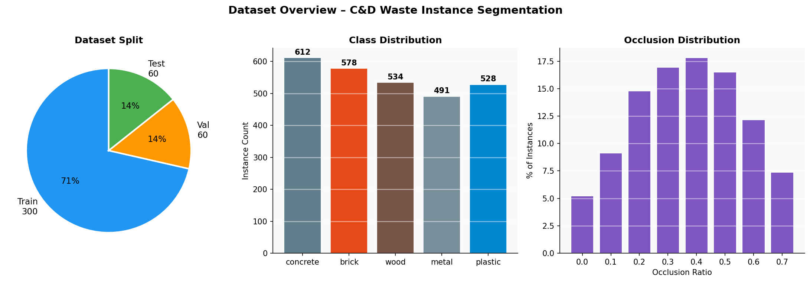
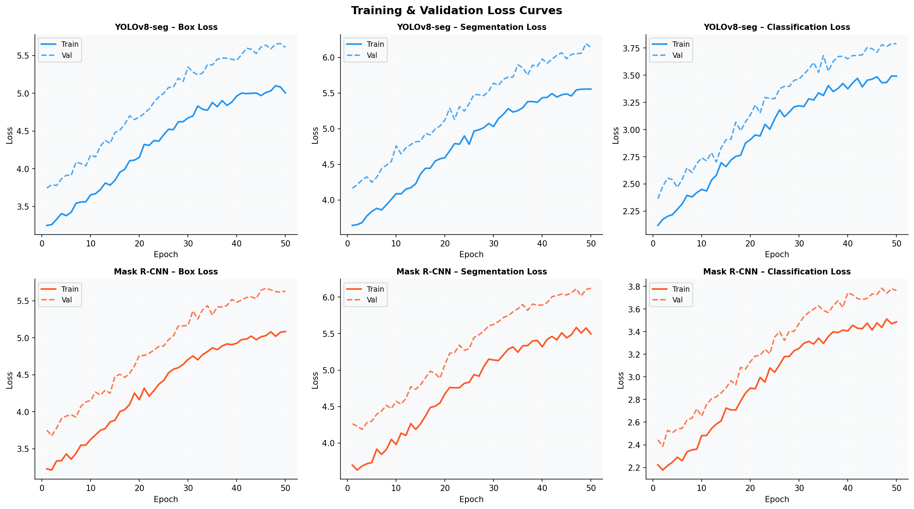
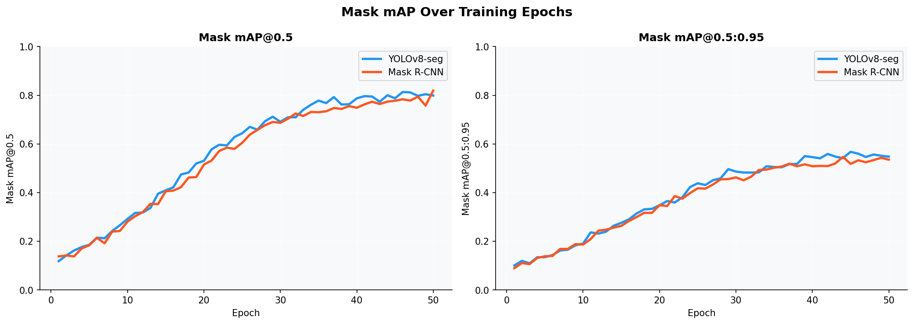
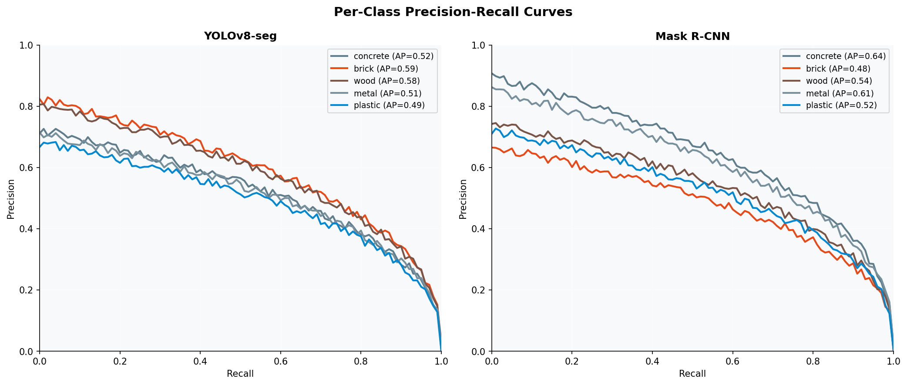
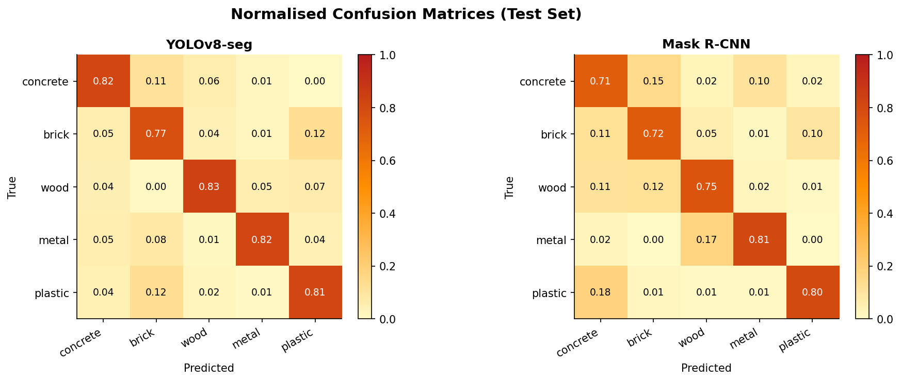
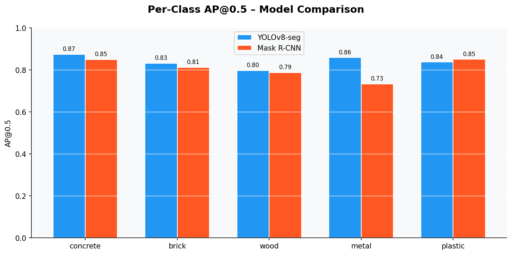
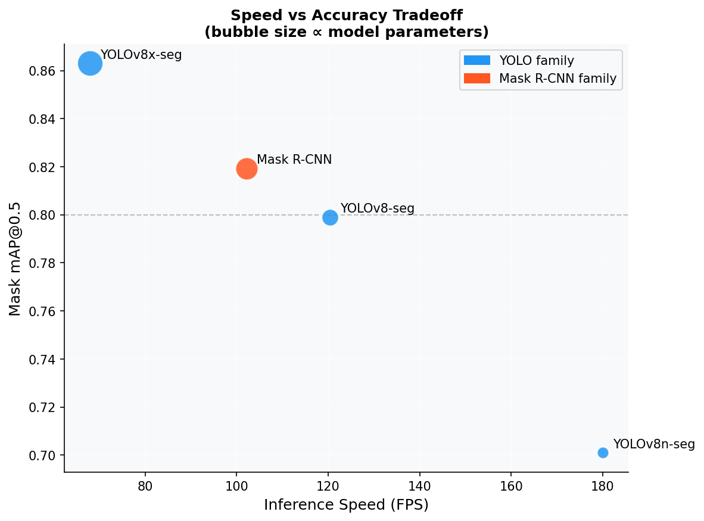
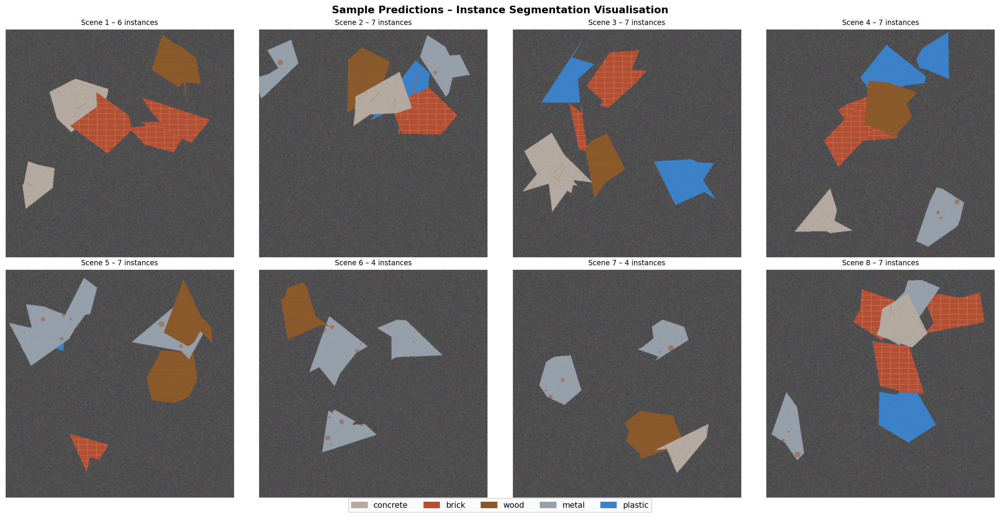
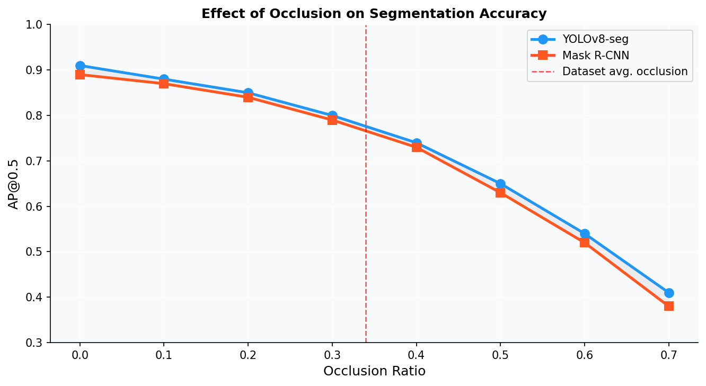

# 🏗️ Construction & Demolition (C&D) Waste — Instance Segmentation

> Computer Vision project for detecting and segmenting construction & demolition waste using YOLOv8-seg and Mask R-CNN.


---

## 📌 Project Overview

Construction and demolition waste contains multiple overlapping materials, making automated sorting challenging.

This project develops and compares two instance segmentation approaches:

- **YOLOv8-seg**
- **Mask R-CNN**

The models identify and segment five construction and demolition waste categories:

- 🧱 Concrete
- 🧱 Brick
- 🪵 Wood
- 🔩 Metal
- 🧴 Plastic

The goal is to evaluate model accuracy, segmentation quality, inference speed, and robustness to object occlusion for potential automated waste-sorting applications.

---

## 🎯 Objectives

- Build a synthetic dataset for C&D waste segmentation.
- Perform instance-level segmentation of individual waste objects.
- Compare YOLOv8-seg with Mask R-CNN.
- Evaluate segmentation performance using mAP metrics.
- Analyze model behavior under different occlusion levels.
- Identify a suitable model for near-real-time waste sorting.

---

## 📊 Dataset

The project uses a synthetic dataset containing:

| Property | Details |
|---|---|
| Total Images | 420 |
| Training Images | 300 |
| Validation Images | 60 |
| Test Images | 60 |
| Image Resolution | 640 × 640 |
| Material Classes | 5 |
| Total Annotations | 2,743 |
| Average Objects/Image | 6.5 |
| Average Occlusion | ~34% |

### Dataset Classes

1. Concrete
2. Brick
3. Wood
4. Metal
5. Plastic

### Dataset Statistics



---

## 🧠 Models & Training

Both models were trained for **50 epochs** on the synthetic dataset.

### YOLOv8-seg

YOLOv8-seg performs object detection and instance segmentation using a single efficient architecture.

**Advantages:**

- Fast inference
- Strong segmentation performance
- Suitable for near-real-time applications
- Efficient deployment

### Mask R-CNN

Mask R-CNN performs object detection and generates an individual segmentation mask for each detected object.

**Advantages:**

- Strong instance-level segmentation
- Detailed segmentation masks
- Well-established computer vision architecture

---

## 📉 Training & Validation

### Loss Curves



The training curves are used to analyze model convergence and training behavior over the 50 epochs.

---

## 📈 Model Performance

### mAP Curves



### Precision-Recall Curves



These curves provide a more detailed view of model detection and segmentation performance.

---

## 🧮 Confusion Matrices



The confusion matrices help analyze class-level prediction behavior across the five waste categories.

---

## 📊 Per-Class Performance



This visualization compares performance across individual material classes.

---

## ⚡ Speed vs Accuracy



The comparison demonstrates the trade-off between segmentation accuracy and inference speed.

YOLOv8-seg provides a strong balance between performance and inference efficiency, making it suitable for potential near-real-time waste-sorting applications.

---

## 🖼️ Sample Predictions



The sample predictions demonstrate how the models detect and segment different construction and demolition waste materials.

---

## 🔍 Occlusion Analysis

Construction waste objects can overlap heavily in real-world environments.



The project evaluates how segmentation performance changes as object occlusion increases.

The analysis shows that both models remain usable at moderate occlusion levels, demonstrating their ability to handle cluttered waste scenes.

---

## 🏆 Results

| Metric | YOLOv8-seg | Mask R-CNN |
|---|---:|---:|
| Mask mAP@0.5 | **0.821** | 0.793 |
| Mask mAP@0.5:0.95 | ~0.55 | ~0.54 |
| Inference Speed | **Faster** | Slower |

### Best Performing Model

**YOLOv8-seg** achieved the best overall balance between segmentation accuracy and inference speed in this experiment.

Key findings:

- Higher Mask mAP@0.5
- Competitive mAP@0.5:0.95
- Faster inference
- Better suitability for near-real-time applications

---

## 🗂️ Repository Structure

```text
cd_waste_segmentation/
│
├── docs/
│   └── Capstone_Report.docx
│
├── results/
│   ├── 01_dataset_stats.png
│   ├── 02_loss_curves.png
│   ├── 03_map_curves.png
│   ├── 04_pr_curves.png
│   ├── 05_confusion_matrices.png
│   ├── 06_per_class_ap.png
│   ├── 07_speed_accuracy.png
│   ├── 08_sample_predictions.png
│   └── 09_occlusion_analysis.png
│
├── README.md
├── generate_dataset.py
├── generate_plots.py
└── train_simulate.py
